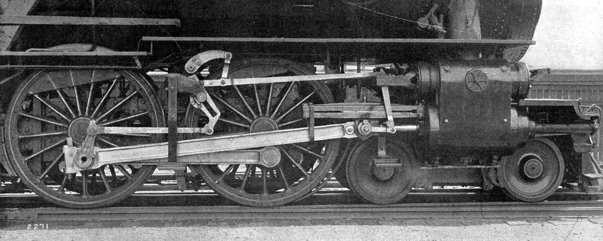

# Piston Connecting Rods

John Wolff

December 6, 2017

---

## Definition

*A **connecting rod** is a shaft which connects a piston to a crank or crankshaft in a reciprocating engine. 
Together with the crank, it forms a simple mechanism that converts reciprocating motion into rotating motion.
Being rigid, a connecting rod may transmit either push or pull, allowing the rod to rotate the crank through both halves of a revolution.*

---

---

## Piston Rod

---

## Manufacturing Processes

1. Casting
2. Forging
3. Forged Billet
4. Sintered

---

## Casting

  - Cast in sand
  - Small little seam on both sides of the parting edge
  - Used in Speed Motors
  - Cap in pin-end is fastened with bolts only
  - Maximum RPM 6500

---

## Forging

  - Thick seam on both sides left from the forging dies
  - Used in Speed Motors
  - I-Beam cross section
  - Bolt-Nut assembly on connecting end
  - RPM of 5500-6800+

---

## Forged Billet

  - Machined from a solid piece of steel, fully machined
  - No parting edge
  - H-Beam cross section
  - Bolts are screwed to hold cap on
  - Up to 1200 HP Engines

---

## Sintered

  - Powder metal, pressed together and put into an oven
  - Parting edge is fractured
  - Each cap and rod is unique
  - Maximum 7000 RPM

---

## Comparison

- *Oldest*: Casting
- *Newest*: Sintered
- *Strongest*: H-Beam Forged Billet

---

*In a steam locomotive, the crank pins are usually mounted directly on one or more pairs of driving wheels, and the axle of these wheels serves as the crankshaft.*

---

