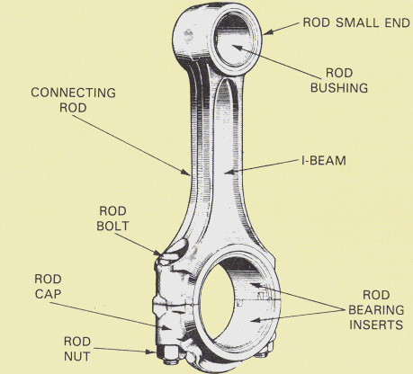

# Piston Connecting Rods

John Wolff

December 6, 2017

---

# Agenda

1. Use
2. Manufacturing
3. Modes of Failure

---

# Definition

> A **connecting rod** is a shaft which connects a piston to a crank or crankshaft in a reciprocating engine. 
Together with the crank, it forms a simple mechanism that converts reciprocating motion into rotating motion.

Wikipedia contributors. "Connecting rod." *Wikipedia, The Free Encyclopedia*.
Wikipedia, The Free Encyclopedia, 25 Nov. 2017. Web. 3 Dec. 2017.

---

# Piston Rod

1. Pin End / Small End
2. Shank Section / I-Beam
3. Crank End / Big End

---

---

# Manufacturing Process

1. Casting
  - Cast in sand
  - Small little seam on both sides of the parting edge
  - Used in Speed Motor
  - 
  - Maximum RPM 6500
2. Forging
3. Forged Billet
4. Sintered 
